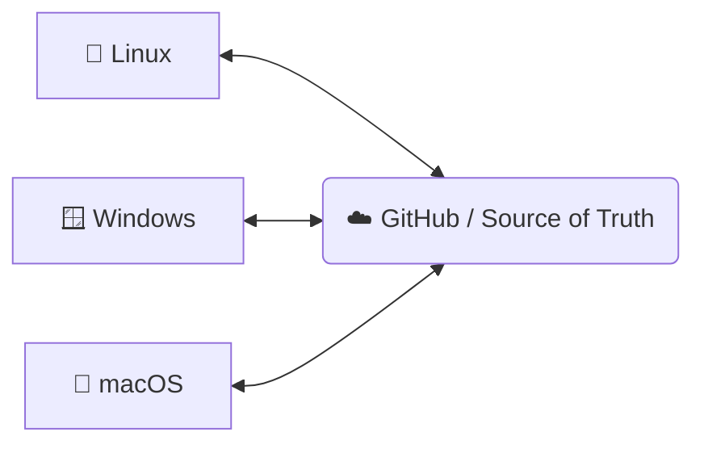

# 🚀 DualBoot Git Sync

> **A safe, deterministic, one-click Git synchronization utility designed for dual-boot developers (Linux + Windows + macOS).**

This tool standardizes your workflow across operating systems and prevents common sync errors by enforcing a **Rebase-First** strategy.

---

## 🎯 The Problem

Dual-boot development often leads to high-friction synchronization issues:

* **Amnesia:** Forgetting to `pull` before starting work on a different OS.
* **Merge Hell:** Conflicts caused by unsynced edits across partitions.
* **Repetitive Tasks:** Typing the same 4-5 Git commands every time you switch.
* **Permission Noise:** NTFS partitions often mess up executable bits and file permissions.

## ✅ The Solution

**DualBoot Git Sync** provides a controlled, explicit synchronization model. Each sync operation performs a strict sequence:

1. `git pull --rebase` (Fetch and align)
2. `git add .` (Stage all changes)
3. `git commit` (Only if changes exist)
4. `git push` (Update remote)

---

## 🧠 Design Philosophy

| **We Do Not** | **We Do** |
| --- | --- |
| ❌ No automatic push on shutdown | ✅ Manual explicit synchronization |
| ❌ No hidden background services | ✅ Dirty state detection |
| ❌ No silent "ghost" commits | ✅ Rebase-first workflow |
| ❌ No automation without consent | ✅ Cross-platform parity |

---

## 📂 Project Structure

```text
dualboot-git-sync/
├── linux/
│   └── sem6_sync.sh        # Bash script for Linux
├── windows/
│   └── sem6_sync.bat       # Batch script for Windows
├── macos/
│   └── sem6_sync.command   # Upgraded macOS command script
└── README.md

```

---

## 🔧 Installation & Setup

### 🐧 Linux

1. Edit `REPO_PATH` inside `linux/sem6_sync.sh`.
2. Make it executable:
```bash
chmod +x linux/sem6_sync.sh

```


3. *(Optional)* Create a `.desktop` launcher for your dock.

### 🪟 Windows

1. Edit `REPO_PATH` inside `windows/sem6_sync.bat`.
2. Create a Desktop shortcut to the `.bat` file.
3. *(Optional)* Right-click **Properties > Change Icon** to use a custom `.ico`.

### 🍎 macOS

1. Edit `REPO_PATH` inside `macos/sem6_sync.command`.
2. Make it executable:
```bash
chmod +x macos/sem6_sync.command

```


3. **First run:** Right-click and select **Open** (to bypass Security & Privacy gatekeeper).

---

## 🔁 Recommended Workflow

To maintain a perfect history without conflicts, follow the **"Sync-In, Sync-Out"** rule:

1. **Boot OS:** Click **Sync** before you write a single line of code.
2. **Code:** Work as usual.
3. **Shutdown/Switch:** Click **Sync** once more before rebooting.

> [!WARNING]
> **Conflict Handling:** If you modify the same file on two different OS without syncing, Git will pause during the **Rebase**. You must manually resolve the conflict. No data is ever silently overwritten.

---

## 🏗 Architecture



---

## 🛡️ License

Distributed under the MIT License. See `LICENSE` for more information.
This project is licensed under the Fair Source License.

Personal & FOSS Use: 100% Free. You can use, modify, and redistribute this for your personal projects or open-source work.

Commercial Use: Free for companies with up to [3] users.

Enterprise: If your company has more than [3] users using this tool, please contact the author for a commercial license.

Copyright (c) 2025 sandeep11mahendrakar. All rights reserved.
